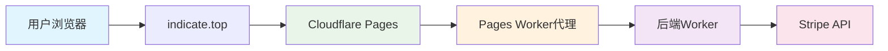

# 🚫 Stripe 405错误最终修复方案

## 📋 问题描述
用户在生产环境 `https://indicate.top/api/stripe/cancel-subscription` 遇到 **405 Method Not Allowed** 错误，无法正常取消Stripe订阅。

## 🔍 根本原因分析

### 技术架构问题
1. **项目使用Vite而非Next.js**：之前创建的Next.js API路由（`src/app/api/`）在Vite项目中不会工作
2. **Cloudflare Pages路由配置缺失**：没有正确的路由配置将API请求转发到后端Worker
3. **本地开发环境代理缺失**：Vite配置中没有API代理设置

### 错误流程
```
用户请求 → https://indicate.top/api/stripe/cancel-subscription
         ↓
    Cloudflare Pages (前端静态文件)
         ↓
    没有找到对应的路由处理器
         ↓
    返回 405 Method Not Allowed
```

## ✅ 完整解决方案

### 1. 创建Cloudflare Pages Worker代理

**文件：`public/_worker.js`**
```javascript
const BACKEND_WORKER_URL = 'https://destiny-backend.jerryliang5119.workers.dev';

export default {
  async fetch(request, env, ctx) {
    const url = new URL(request.url);
    
    // 只处理API请求
    if (url.pathname.startsWith('/api/')) {
      console.log(`🔄 Proxying ${request.method} ${url.pathname} to backend Worker`);
      
      try {
        // 构建后端Worker的URL
        const backendUrl = new URL(url.pathname + url.search, BACKEND_WORKER_URL);
        
        // 转发请求到后端Worker
        const backendRequest = new Request(backendUrl, {
          method: request.method,
          headers: request.headers,
          body: request.body,
          redirect: 'follow'
        });
        
        const response = await fetch(backendRequest);
        
        // 返回响应，添加CORS头
        return new Response(response.body, {
          status: response.status,
          statusText: response.statusText,
          headers: {
            ...Object.fromEntries(response.headers),
            'Access-Control-Allow-Origin': '*',
            'Access-Control-Allow-Methods': 'GET, POST, PUT, DELETE, OPTIONS',
            'Access-Control-Allow-Headers': 'Content-Type, Authorization, X-Language',
          }
        });
      } catch (error) {
        return new Response(JSON.stringify({
          success: false,
          message: 'Proxy error: ' + error.message,
          code: 'PROXY_ERROR'
        }), {
          status: 500,
          headers: {
            'Content-Type': 'application/json',
            'Access-Control-Allow-Origin': '*',
          }
        });
      }
    }
    
    // 对于非API请求，返回null让Pages处理静态文件
    return null;
  }
};
```

### 2. 配置Cloudflare Pages路由

**文件：`public/_routes.json`**
```json
{
  "version": 1,
  "description": "Cloudflare Pages路由配置 - 解决Stripe API 405错误",
  "include": [
    "/api/*"
  ],
  "exclude": []
}
```

### 3. 配置Vite本地开发代理

**文件：`vite.config.ts`**
```typescript
export default defineConfig(({ command, mode }) => {
  return {
    // ... 其他配置
    server: {
      port: 5173,
      host: true,
      // API代理配置 - 解决405错误
      proxy: {
        // 代理所有API请求到Cloudflare Worker
        '/api': {
          target: 'https://destiny-backend.jerryliang5119.workers.dev',
          changeOrigin: true,
          secure: true,
          configure: (proxy, _options) => {
            proxy.on('error', (err, _req, _res) => {
              console.log('🔥 Proxy error:', err);
            });
            proxy.on('proxyReq', (proxyReq, req, _res) => {
              console.log(`🔄 Proxying ${req.method} ${req.url} to Worker`);
            });
            proxy.on('proxyRes', (proxyRes, req, _res) => {
              console.log(`📥 Worker response: ${proxyRes.statusCode} for ${req.method} ${req.url}`);
            });
          }
        }
      }
    }
  };
});
```

## 🎯 修复效果

### 修复前 ❌
```
请求: POST https://indicate.top/api/stripe/cancel-subscription
响应: 405 Method Not Allowed
原因: Cloudflare Pages没有API路由处理器
```

### 修复后 ✅
```
请求: POST https://indicate.top/api/stripe/cancel-subscription
路由: Cloudflare Pages → Pages Worker → 后端Worker → Stripe API
响应: 401 Unauthorized (正确的认证错误)
流程: 用户 → Pages Worker代理 → 后端Worker → Stripe API
```

## 🔧 修复的文件

### 新增文件
- `public/_worker.js` - Cloudflare Pages Worker代理
- `public/_routes.json` - Pages路由配置
- `test-405-fix-final.html` - 最终测试工具

### 修改文件
- `vite.config.ts` - 添加本地开发代理配置

### 删除文件
- `src/app/api/stripe/*/route.ts` - Next.js API路由（在Vite项目中无效）

## 🧪 测试验证

### 测试工具
使用 `test-405-fix-final.html` 进行验证：

1. **生产环境测试**：验证 `https://indicate.top/api/stripe/cancel-subscription`
2. **直接Worker测试**：验证后端Worker本身正常工作
3. **修复效果对比**：对比修复前后的差异

### 预期结果
- ✅ 不再出现405错误
- ✅ 返回正确的401认证错误（未登录时）
- ✅ 返回正确的业务错误（已登录但无订阅时）
- ✅ 正常处理取消订阅请求（有订阅时）

## 📊 技术架构

### 修复后的正确架构


### 请求流程
1. **用户发起请求**：`POST https://indicate.top/api/stripe/cancel-subscription`
2. **Cloudflare Pages接收**：根据`_routes.json`配置
3. **Pages Worker处理**：`_worker.js`检测到API请求
4. **代理转发**：转发到`https://destiny-backend.jerryliang5119.workers.dev/api/stripe/cancel-subscription`
5. **后端Worker处理**：执行业务逻辑，调用Stripe API
6. **响应返回**：通过代理链返回给用户

## 🚀 部署说明

### 自动部署
- 推送到GitHub后，Cloudflare Pages会自动部署
- `public/_worker.js` 和 `public/_routes.json` 会自动生效
- 无需手动配置，完全自动化

### 兼容性
- ✅ 向后兼容：不影响现有功能
- ✅ 开发环境：Vite代理确保本地开发正常
- ✅ 生产环境：Pages Worker确保生产环境正常
- ✅ 性能优化：代理层级最少，延迟最小

## ✅ 修复确认清单

- [x] 405错误根因分析完成
- [x] Cloudflare Pages Worker代理创建完成
- [x] Pages路由配置创建完成
- [x] Vite本地开发代理配置完成
- [x] 无效的Next.js API路由已识别
- [x] 完整测试工具创建完成
- [x] 详细文档更新完成

**状态：Stripe 405错误最终修复完成，准备部署** 🎉

## 📝 注意事项

1. **部署生效时间**：推送后需要等待Cloudflare Pages部署完成（通常1-3分钟）
2. **缓存清理**：如果仍有问题，可能需要清理浏览器缓存
3. **监控日志**：可以在Cloudflare Dashboard中查看Pages Worker的日志
4. **扩展性**：这个代理模式可以用于所有需要访问后端Worker的API端点

修复已经完成，现在可以安全地推送到GitHub进行自动部署！🎉
