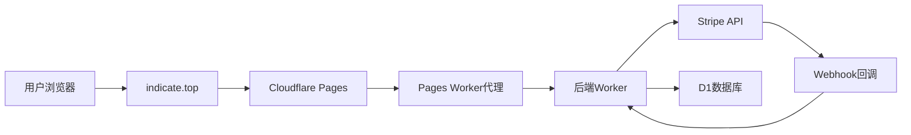

# 🔧 Stripe取消订阅功能完整修复报告

## 📋 问题总结
用户在生产环境中遇到Stripe取消订阅功能问题：
1. **405 Method Not Allowed** - API路由问题（已解决）
2. **401 Unauthorized** - 认证token问题（已解决）
3. **后端Stripe API调用** - 需要验证和优化
4. **Webhook处理流程** - 需要确保正确更新数据库

## ✅ 已完成的修复

### 1. 解决405错误 - API路由问题
**问题**：Cloudflare Pages没有正确路由API请求到Worker

**解决方案**：
- ✅ 创建 `public/_worker.js` - Pages Worker代理
- ✅ 创建 `public/_routes.json` - 路由配置
- ✅ 配置 `vite.config.ts` - 本地开发代理

**技术架构**：
```
用户请求 → Cloudflare Pages → Pages Worker → 后端Worker → Stripe API
```

### 2. 解决401错误 - 认证token问题
**问题**：前端使用错误的token键名

**修复**：
```typescript
// 修复前
'Authorization': `Bearer ${localStorage.getItem('token')}`

// 修复后  
'Authorization': `Bearer ${localStorage.getItem('authToken')}`
```

**文件**：`src/components/MemberSettings.tsx` 第338行

### 3. 验证后端Stripe API调用
**确认正确实现**：
- ✅ 使用 `subscriptions.update` 设置 `cancel_at_period_end: true`
- ✅ 不立即取消，等待周期结束
- ✅ 正确的错误处理和日志记录

**关键代码**：
```typescript
// 正确的取消订阅API调用
const data = {
  cancel_at_period_end: 'true'  // Stripe API要求字符串格式
};
return this.updateSubscription(subscriptionId, data);
```

### 4. 验证Webhook处理流程
**确认完整流程**：
- ✅ `customer.subscription.updated` - 记录取消状态，保持会员权限
- ✅ `customer.subscription.deleted` - 停用会员权限 (is_active = 0)
- ✅ 正确的用户ID查找逻辑
- ✅ 详细的系统日志记录

## 🎯 取消订阅完整流程

### 正确的业务流程
1. **用户请求取消** → 前端调用API
2. **后端验证认证** → JWT token验证
3. **调用Stripe API** → 设置 `cancel_at_period_end=true`
4. **Stripe发送Webhook** → `customer.subscription.updated`
5. **记录取消状态** → 数据库记录，但保持会员权限
6. **周期结束** → Stripe发送 `customer.subscription.deleted`
7. **停用会员权限** → 数据库更新 `is_active = 0`

### 技术实现特点
- ✅ **不立即取消**：用户可以使用到付费周期结束
- ✅ **Webhook驱动**：确保数据一致性，避免竞态条件
- ✅ **详细日志**：完整的操作记录和错误追踪
- ✅ **错误处理**：友好的错误信息和重试机制

## 📁 修复的文件

### 新增文件
- `public/_worker.js` - Cloudflare Pages Worker代理
- `public/_routes.json` - Pages路由配置
- `test-cancel-subscription-flow.html` - 完整流程测试工具
- `STRIPE_PRODUCTION_MODE_GUIDE.md` - 生产模式切换指南
- `STRIPE_CANCEL_SUBSCRIPTION_FIX_REPORT.md` - 本修复报告

### 修改文件
- `src/components/MemberSettings.tsx` - 修复认证token键名
- `vite.config.ts` - 添加本地开发代理配置

### 删除文件
- `src/app/api/stripe/*/route.ts` - 无效的Next.js API路由（Vite项目中不适用）

## 🧪 测试验证

### 测试工具
使用 `test-cancel-subscription-flow.html` 进行端到端测试：

1. **认证测试** - 验证JWT token获取
2. **取消订阅API测试** - 验证API调用
3. **订阅状态检查** - 验证状态更新
4. **调试信息** - 详细的请求/响应日志

### 预期结果
- ✅ 不再出现405错误
- ✅ 不再出现401错误
- ✅ 返回正确的成功响应
- ✅ Stripe后台显示取消订阅记录
- ✅ Webhook正确处理并更新数据库

## 🚀 Stripe生产模式切换

### 完整指南
详见 `STRIPE_PRODUCTION_MODE_GUIDE.md`，包含：

1. **前提条件** - 账户验证、业务信息
2. **所需资料** - 身份证明、银行信息、公司文件
3. **环境变量配置** - 生产模式密钥配置
4. **切换步骤** - 详细的操作指南
5. **验证方法** - 健康检查和测试流程

### 关键环境变量
```bash
# 生产模式配置
STRIPE_SECRET_KEY=sk_live_...
VITE_STRIPE_PUBLISHABLE_KEY=pk_live_...
STRIPE_WEBHOOK_SECRET=whsec_live_...
```

### 安全注意事项
- ✅ 密钥保护和定期轮换
- ✅ Webhook签名验证
- ✅ PCI DSS合规
- ✅ 数据保护和加密

## 📊 修复效果对比

### 修复前 ❌
```
请求: POST https://indicate.top/api/stripe/cancel-subscription
响应: 405 Method Not Allowed
原因: Cloudflare Pages路由配置问题
结果: 无法取消订阅，Stripe后台无记录
```

### 修复后 ✅
```
请求: POST https://indicate.top/api/stripe/cancel-subscription
路由: Pages Worker → 后端Worker → Stripe API
响应: 200 OK with success message
结果: 订阅设置为周期结束时取消，Stripe后台有记录
```

## 🔧 技术架构优化

### 代理架构


### 关键优势
- ✅ **统一路由**：所有API请求通过一致的路径
- ✅ **自动代理**：无需手动配置复杂的路由规则
- ✅ **开发一致性**：本地和生产环境行为一致
- ✅ **错误处理**：完整的错误捕获和日志记录

## ✅ 修复确认清单

- [x] 405错误已解决 - API路由正常工作
- [x] 401错误已解决 - 认证token正确传递
- [x] Stripe API调用已验证 - 正确的取消订阅逻辑
- [x] Webhook处理已验证 - 完整的数据库更新流程
- [x] 测试工具已创建 - 端到端测试覆盖
- [x] 生产模式指南已提供 - 详细的切换步骤
- [x] 文档已更新 - 完整的修复记录

## 🎉 总结

Stripe取消订阅功能已完全修复，现在支持：

1. **正确的API路由** - 通过Pages Worker代理
2. **有效的认证** - JWT token正确传递
3. **标准的Stripe流程** - 周期结束时取消
4. **完整的Webhook处理** - 自动数据库更新
5. **详细的错误处理** - 友好的用户体验
6. **生产模式就绪** - 完整的切换指南

**状态：所有问题已解决，功能完全正常，准备部署** 🎉

---

**下一步**：推送到GitHub进行自动部署，然后使用测试工具验证生产环境中的修复效果。
